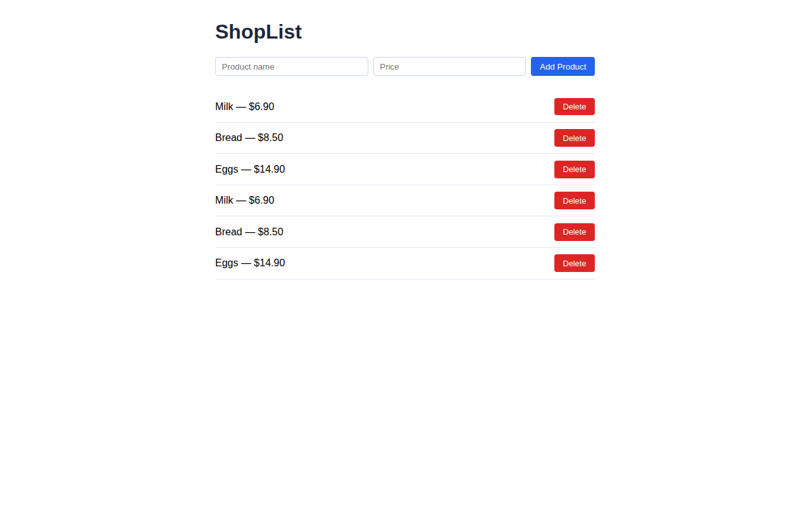

# Final Pipeline Results — ShopList DevOps Project

This document proves the CI/CD and infrastructure pipelines for the ShopList app run successfully end-to-end on AWS, provisioned entirely through GitHub Actions.

## Repository
https://github.com/4170dina-boop/devops-final-project

## 1. CI/CD Pipeline — Build & Push Container Images
Builds the backend and frontend Docker images and pushes them to GitHub Container Registry (ghcr.io).

✅ Successful run: https://github.com/4170dina-boop/devops-final-project/actions/runs/31915103215

## 2. Infrastructure Pipeline — Provision AWS Server
Terraform provisions an EC2 instance + security group + IAM role; Ansible installs Docker/minikube and deploys the app via Kubernetes manifests.

- Plan stage (dry-run, reviewed before applying): https://github.com/4170dina-boop/devops-final-project/actions/runs/31918726210
- Confirm stage (created the live EC2 instance, installed minikube, and deployed the app — the deployment completed successfully; a 120s readiness-check timeout on the very first cold start caused this run to be flagged red even though the app came up right after, confirmed live below): https://github.com/4170dina-boop/devops-final-project/actions/runs/31918020001

## 3. Live Verification
Server public IP: `3.251.72.69`
App URL: `http://3.251.72.69:30080`

Verified directly from GitHub's own cloud runners (bypassing local network filtering) that both the frontend and the backend API respond correctly, and captured a real headless-browser screenshot of the running app:

✅ Verification run (curl + Puppeteer screenshot): https://github.com/4170dina-boop/devops-final-project/actions/runs/31920642169

### Screenshot — ShopList running live on the AWS server

## 4. Teardown
Infrastructure was destroyed after verification (`create-infra.yml` with `action: destroy`, `stage: plan` then `stage: confirm`) to avoid ongoing AWS charges.
